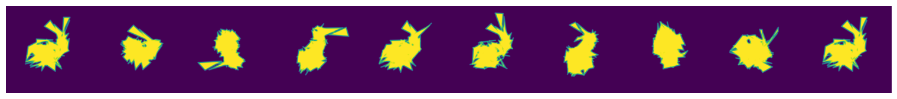
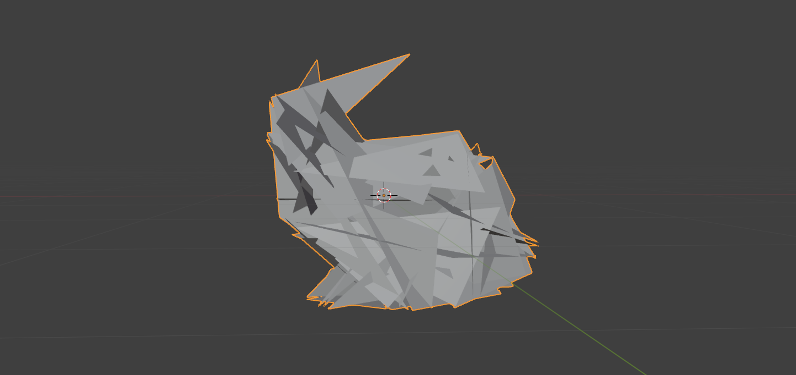
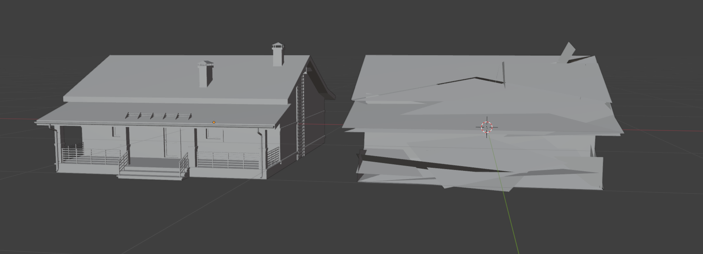
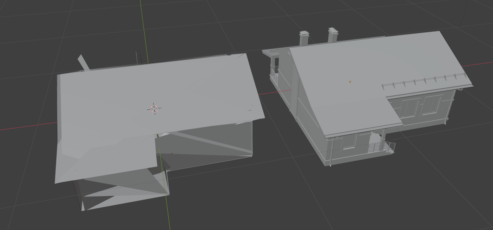

# DeepLearning Occluder

Input Mesh  

Preliminary Occluder  

Final Occluder  

## Reference
[1] Jiaxian Wu, Yue Lin, and Dehui Lu. 2023. DR-Occluder: Generating Occluders Using Differentiable Rendering. ACM Trans. Graph. 42, 6, Article 231 (December 2023), 14 pages. https://doi.org/10.1145/3618346